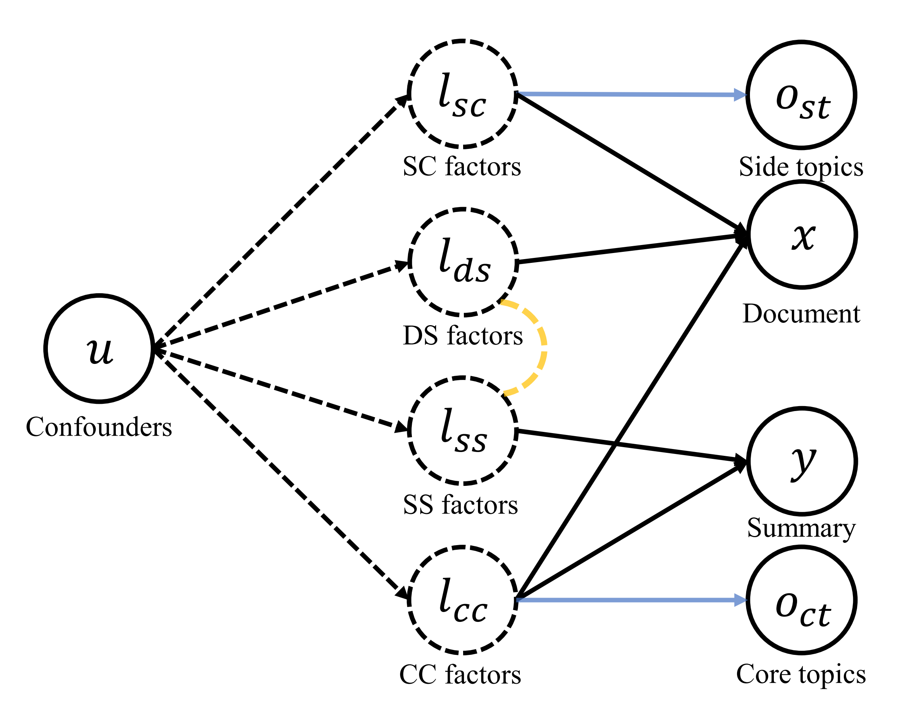
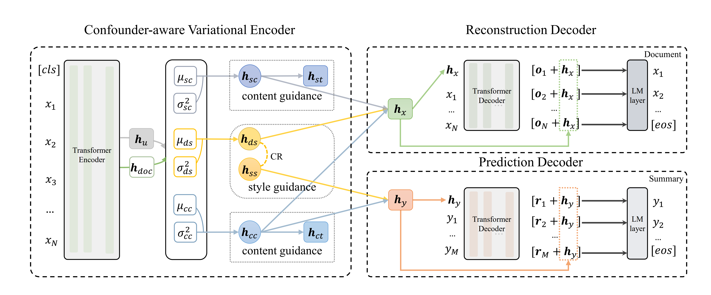

# CI-Seq2Seq
Implementation code for the paper "[Inducing Causal Structure for Abstractive Text Summarization](https://dl.acm.org/doi/pdf/10.1145/3583780.3614934)", accepted by CIKM 2023.

## Abstract

<p align="center">
  <picture>
    
  </picture>
</p>

The mainstream of data-driven abstractive summarization models tends to explore the correlations rather than the causal relationships. Among such correlations, there can be spurious ones which suffer from the language prior learned from the training corpus and therefore undermine the overall effectiveness of the learned model. To tackle this issue, we introduce a Structural Causal Model (SCM) to induce the underlying causal structure of the summarization data. We assume several latent causal factors and non-causal factors, representing the content and style of the document and summary. Theoretically, we prove that the latent factors in our SCM can be identified by fitting the observed training data under certain conditions. On the basis of this, we propose a Causality Inspired Sequence-to-Sequence model (CI-Seq2Seq) to learn the causal representations that can mimic the causal factors, guiding us to pursue causal information for summary generation. The key idea is to reformulate the Variational Auto-encoder (VAE) to fit the joint distribution of the document and summary variables from the training corpus. Experimental results on two dely used text summarization datasets monstrate the advantages of our approach.

<p align="center">
  <picture>
    
  </picture>
</p>

## Citation

If you find our work useful, please consider citing our paper:
```
@inproceedings{chen2023inducing,
  title={Inducing Causal Structure for Abstractive Text Summarization},
  author={Chen, Lu and Zhang, Ruqing and Huang, Wei and Chen, Wei and Guo, Jiafeng and Cheng, Xueqi},
  booktitle={Proceedings of the 32nd ACM International Conference on Information and Knowledge Management},
  pages={213--223},
  year={2023}
}
```
